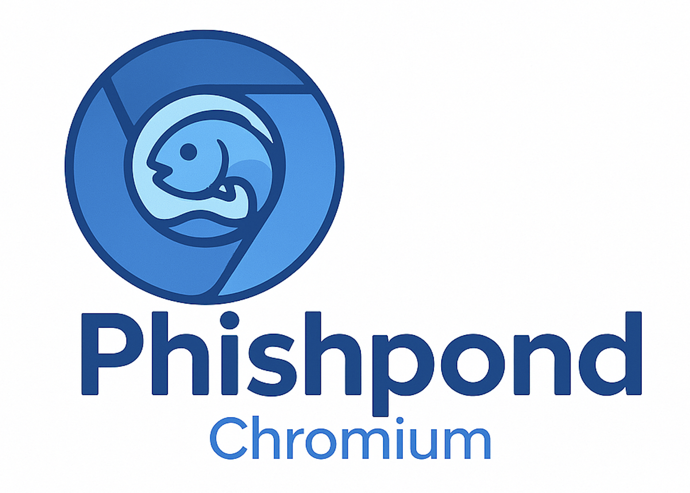

## What is phishpond-chromium?
It is based on [zerofox-oss/phishpond](https://github.com/zerofox-oss/phishpond) and uses Chromium.

It's a pre-built docker environment which allows you to quickly, easily and safely spin up phishing kits for analysis. Out of the box you can browse, "mitm" web traffic, log mail calls to flat files and debug PHP code remotely.

## How to use
1. `git clone https://github.com/masaomi346/phishpond-chromium.git`
2. Place phishing kit on `./phishpond/www/`.
3. `cd ./phishpond/`
4. Configure any db connection strings within `docker-compose.yml`
5. Run `docker compose up -d`
6. Browse to `http://localhost:3000` for the virtual browser
7. Browse to `http://localhost:8080` for mitmproxy
8. Within the virtual browser navigate to `http://phishpond.local`

(First time setup)
1. Open preferences within the virtual browser
2. Search `cert`
3. Click `view certificates`
4. Click the authorities tab
5. Click Import
6. Import `/config/certs/mitmproxy-ca-cert.pem`
7. Tick `Trust this CA to identify websites`
8. OK

You will need to repeat these steps every time you remove the `browser-volume`
