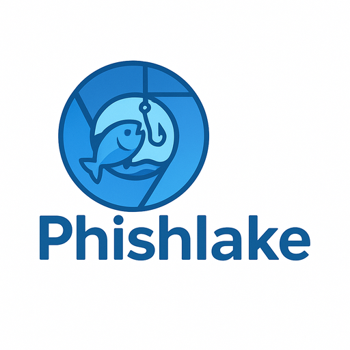

## What is phishlake?
phishlake is phishing kit analysis tool.
It is based on [phishpond](https://github.com/zerofox-oss/phishpond).

It's a pre-built docker environment which allows you to quickly, easily and safely spin up phishing kits for analysis. Out of the box you can browse, "mitm" web traffic, log mail calls to flat files and debug PHP code remotely.

Chromium Browser + mitmproxy

## How to use
### Docker Compose
1. `git clone https://github.com/masaomi346/phishlake.git`
2. Place phishing kit on `./phishlake/www/`.
3. `cd ./phishlake/`
4. Configure any db connection strings within `docker-compose.yml`
5. Run `docker compose up -d`
6. Browse to `http://localhost:3000` for the virtual browser
7. Browse to `http://localhost:8080` for mitmproxy (password:mitmweb)
8. Within the virtual browser navigate to `http://phishlake.local`

### Certificates setup
1. Open preferences within the virtual browser
2. Setting -> Privacy and Security -> Security -> Manage certificates
3. Tab `Authorities`
4. Click Import
5. Import `/home/cert/mitmproxy-ca-cert.pem`
6. Tick `Trust this certificate for identifying websites`
7. OK

You will need to repeat these steps every time you remove the `browser-volume`
